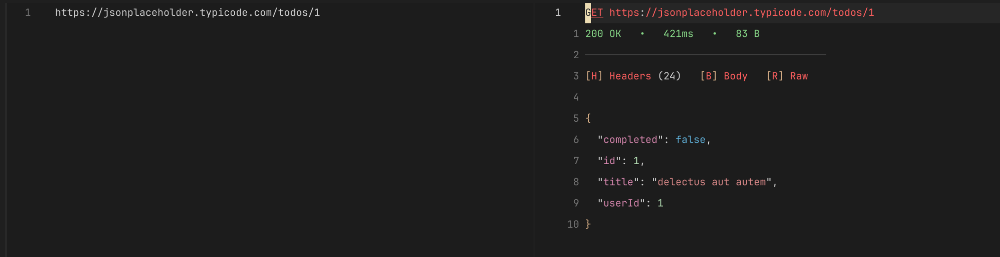
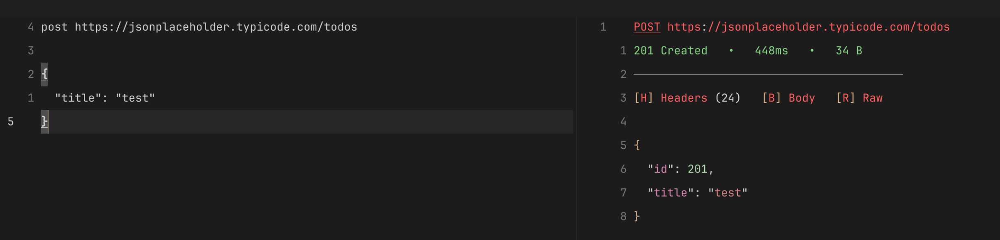

# Restman.nvim

Send HTTP requests directly neovim with any file type

## Demo




## Features

- **Multiple request formats:** HTTP-style, cURL, DSL
- **Async HTTP client** with timeout, headers, query params, form data, JSON body
- **Response viewer** with syntax highlighting (JSON/HTML/XML)
- **Floating window** + split/vsplit/tab modes
- **Environment support** with variable substitution
- **Request history** — persist, replay, jump to source, and send to quickfix list
- **Telescope picker** for environment/history selection (with fallback to `vim.ui.select`)
- **Keymaps** for easy navigation and response inspection
- **Pretty-printed JSON** with proper syntax highlighting

## Requirements

- Neovim ≥ 0.10
- `curl` in PATH
- (Optional) Telescope for enhanced picker experience

## Installation

Using `lazy.nvim`:

```lua
{
  "nxhung2304/restman.nvim",
  config = function()
    require("restman").setup()
  end,
}
```

## Commands

| Command | Action |
|---------|--------|
| `:Restman send` | Send request at cursor |
| `:Restman repeat` | Re-send last request |
| `:Restman new [method]` | Generate request template (picker if no method) |
| `:Restman env` | Switch environment |
| `:Restman history` | Open request history picker |
| `:Restman history clear` | Clear all history entries |
| `:Restman cancel` | Cancel in-flight request |
| `:Restman health` | Show plugin diagnostics |

### Command completion

Type `:Restman <Tab>` to see available subcommands.

## Default Keymaps

| Keymap | Action |
|--------|--------|
| `<leader>rs` | Send request (normal + visual) |
| `<leader>rr` | Repeat last request |
| `<leader>re` | Select environment |
| `<leader>rh` | Open history |
| `<leader>rc` | Cancel request |

## Configuration

Default configuration (can be overridden in `setup()`):

```lua
require("restman").setup({
  keymaps = {
    send = "<leader>rs",
    repeat_last = "<leader>rr",
    env = "<leader>re",
    history = "<leader>rh",
    cancel = "<leader>rc",
  },
  response_view = {
    default_view = "float",  -- "float" | "split" | "vsplit" | "tab"
    float = {
      relative = "editor",
      width = 0.8,   -- 80% of editor width
      height = 0.7,  -- 70% of editor height
      border = "rounded",
    },
    split = {
      position = "right",
      size = 80,  -- column width
    },
  },
  timeout = 30,  -- request timeout in seconds
  history = {
    enabled = true,
    max_entries = 100,
    deduplicate = true,  -- keep only latest entry per file:line (set false to keep full timeline)
  },
})
```

## Environment Variables

Create `.env.json` in your project root:

```json
{
  "default": "development",
  "environments": {
    "development": {
      "base_url": "http://localhost:3000",
      "variables": {
        "TOKEN": "dev-token-123",
        "API_KEY": "dev-key"
      },
      "headers": {
        "Authorization": "Bearer {{TOKEN}}"
      }
    },
    "production": {
      "base_url": "https://api.example.com",
      "variables": {
        "TOKEN": "prod-token-xyz"
      }
    }
  }
}
```

Use variables in requests:

```http
GET {{base_url}}/users
Authorization: Bearer {{TOKEN}}
X-API-Key: {{API_KEY}}
```

## Response Buffer Keymaps

When response window is open, these keys are available:

| Key | Action |
|-----|--------|
| `q`, `<Esc>` | Close response |
| `H` | Toggle headers view |
| `B` | Show body only |
| `R` | Toggle raw/pretty view |
| `y` | Yank body to clipboard |
| `yy` | Yank full response to clipboard |
| `<CR>` | Save body to file (prompts for path) |
| `s` | Promote to split window |
| `v` | Promote to vsplit window |
| `t` | Promote to tab window |
| `<C-o>` | Open response history picker |

